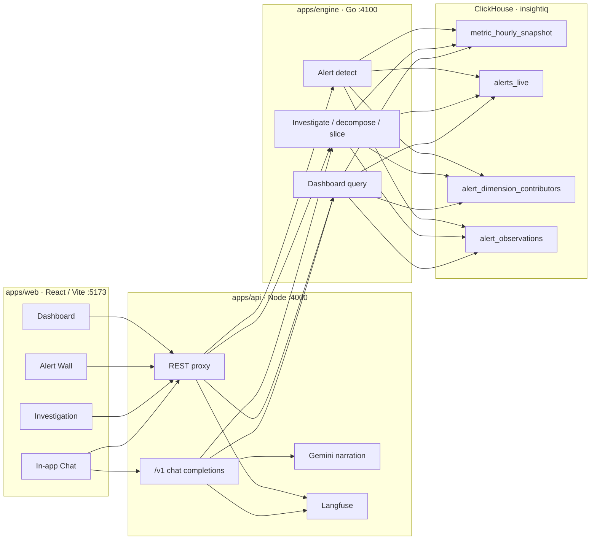

# Architecture

## Overview

InsightIQ detects ad-metric anomalies in ClickHouse, runs deterministic root-cause analysis in a Go engine, and narrates results with an LLM that only sees computed evidence.



## Layers

### Data plane — ClickHouse (`insightiq`)

Product paths query the pre-aggregated layer only (not `ad_events_raw`):

| Object | Role |
|--------|------|
| `ad_events_raw` | Ingest facts |
| `mv_hourly` | Materialized view → `agg_hourly` |
| `agg_hourly` | Hourly SummingMergeTree rollup |
| `metric_hourly_snapshot` | VIEW over `agg_hourly` (+ fill_rate, ctr, ecpm, rpr) |
| `baseline_hourly` | Expected values per advertiser × metric × hour |
| `alerts_live` | Z-score anomalies |
| `alert_dimension_contributors` | Segment attribution |
| `alert_observations` | Ordered observation notes |
| `alert_rules` | Detection policy |

Details: [data-model.md](./data-model.md).

### Investigation engine — Go (`:4100`)

- List alerts (`day` or `hour` granularity)
- Investigate: baseline → metric decompose → dimension slice → seasonality / waterfall / counterfactual / hypotheses
- Dashboard meta and filtered timeseries
- Investigation export (diagnosis, trace, evidence hash)

### API — Node (`:4000`)

- Proxies alerts, investigations, dashboard
- Gemini narrates structured evidence only
- OpenAI-compatible `/v1/chat/completions` for in-app chat and LibreChat
- Optional Langfuse tracing

### Web — React (`:5173`)

| Route | Purpose |
|-------|---------|
| `/` | Analytics dashboard |
| `/alerts` | Alert wall (Daily / Hourly) |
| `/investigations/:id` | RCA workspace + export |
| `/chat` | Natural-language Q&A |

## Request paths

1. **Alert wall** — Web → API → Engine → `alerts_live`
2. **Open alert** — Web → API → Engine investigate → diagnosis JSON
3. **Filter questions in chat** — API parses filters/dates → dashboard query → narrate
4. **RCA questions in chat** — resolve investigation → narrate from evidence

## Design principles

| Principle | Meaning |
|-----------|---------|
| Compute near the data | RCA in Go / ClickHouse |
| Evidence-bound LLM | Model explains numbers the engine computed |
| View layer only | Product paths do not scan raw events |
| Traceability | Investigation `trace`, optional Langfuse, evidence hash |

## Repo map

```
apps/web/                 React UI
apps/api/                 Node BFF + Gemini + chat
apps/engine/              Go ClickHouse RCA engine
packages/contracts/       Investigation JSON schema
infra/clickhouse/         View-layer SQL reference
infra/librechat/          LibreChat config
scripts/export-investigation.mjs  Investigation export CLI
docs/                     Documentation
```
